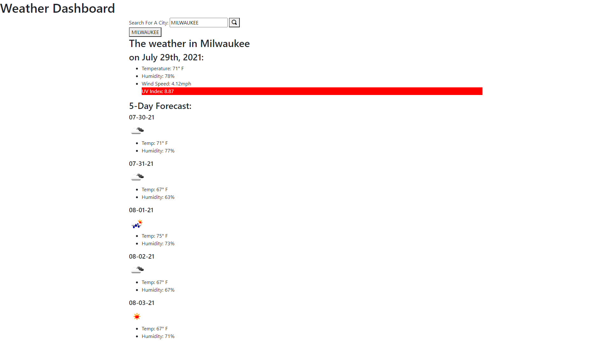

  # React Portfolio

  

  ## Description
  
  An application to display dynamic weather based upon user typed city

  ## Table of Contents
  
  * [Installation](#installation)
  * [Usage](#usage)
  * [Contributing](#contributing)
  * [Tests](#tests)
  * [Questions](#questions)
  
  ## Installation
  
  No installation necessary, just clone the repo or download the zip.

  ## Usage
  
  Used to display weather statistics within a user typed city. Future development would include better styling and use of CSS and localStorage. Buttons to recall old cities do not work at this time.

  ## Contributing
  
  No contributors at this time

  ## Tests
  
  No collaborators at this time

  ## Questions
  
  Reach out to me at the links below with any questions, comments, or concerns:

  GitHub: [adamlsn](https://github.com/adamlsn) 
  email: [adamlsn@gmail.com](mailto:adamlsn@gmail.com)
  